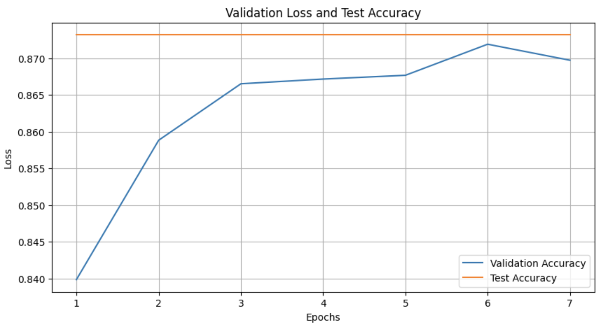
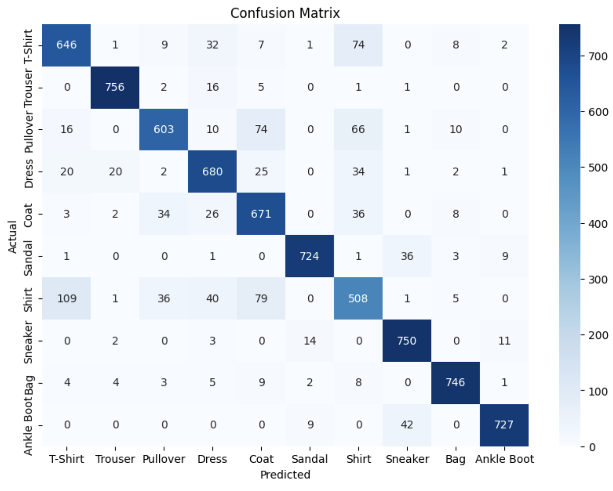
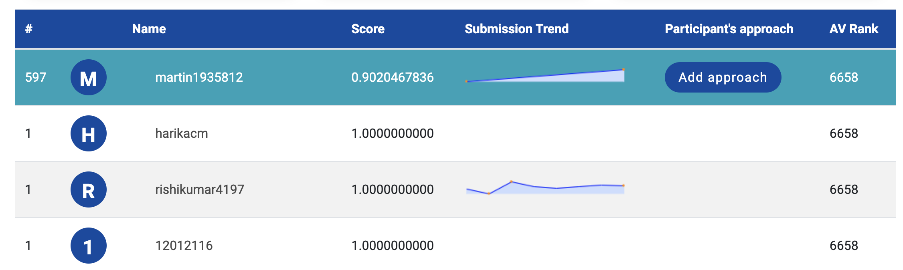

# Image Classification Transformer


## Problem

#### [Identify the apparels (Fashion MNIST)](https://datahack.analyticsvidhya.com/contest/practice-problem-identify-the-apparels/download/test-file)

> We have total 70,000 images (28 x 28), out of which 60,000 are part of train images with the label of the type of apparel (total classes: 10) and rest 10,000 images are unlabelled (known as test images).The task is to identify the type of apparel for all test images. Given below is the code description for each of the apparel class/label.

|label|description|
|---|---|
|0|T-shirt/top|
|1|Trouser|
|2|Pullover|
|3|Dress|
|4|Coat|
|5|Sandal|
|6|Shirt|
|7|Sneaker|
|8|Bag|
|9|Ankle boot|

> Public and Private split for test images are 40:60.
> The evaluation metric for this challenge is multi-class accuracy.

## Solution

We use a Vision Transformer (ViT) model as a starting point and train a small fully connected network on top of it to classify clothing images. The images from the dataset are preprocessed and augmented with random transformations. This, along with dropout layers, helps the model learn the information in the images effectively. At the end, we evaluate the model's accuracy and confusion matrix to understand its performance. We also create multiple versions of the same model, each aiming to improve on the previous results without replacing them.

## Instructions

* Download the dataset from [DataHack](https://datahack.analyticsvidhya.com/contest/practice-problem-identify-the-apparels/download/test-file)). The expected file directory is:

|Path|Description|
|---|---|
|`data/train.csv`|The CSV file containing the image IDs and the labels of the training dataset.|
|`data/test.csv`|The CSV file containing the image IDs and the labels of the test dataset.|
|`data/train`|The images referrenced by the training dataset.|
|`data/test`|The images referrenced by the test dataset.|

* Run the Jupyter Notebook:

```bash
virtualenv -p python3 venv
source venv/bin/activate
pip install -r requirements.txt
jupyter notebook
```

## Versions

|Version|Description|
|---|---|
|[v1](./training_v1.ipynb)|This serves as a proof of concepts of the Python code. It trains only up to `3` batches per epoch, so that we can validate in very short time that there are no errors.|
|[v2](./training_v2.ipynb)|This runs the same training pipeline but with a significant larger number of batches (`100`), with the goal of proving that the model is learning. The previous version outputs an accuracy of approximately `50%` after `10` epochs. However, after the very first epoch, this new version has an accuracy of approximately `70%`. The test accuracy is approximately `78%`.|
|[v3](./training_v3.ipynb)|This runs the model without skipping any batch. After the success of the previous 2 versions, this is the first attempt to build a final product with actual value. AFter the first epoch, this version has an accuracy of approximatey `84%` which is significantly better than the accuracy of the previous model after `10` epochs. The model accuracy increased to `87%` on the test set.|
|[v4](./training_v4.ipynb)|Unfortunately, according to the confusion matrix, the previous model makes too many errors when classifying t-shirts and coats. As a result, this version gives more weight to the loss function of those 2 categories.|

## Results






